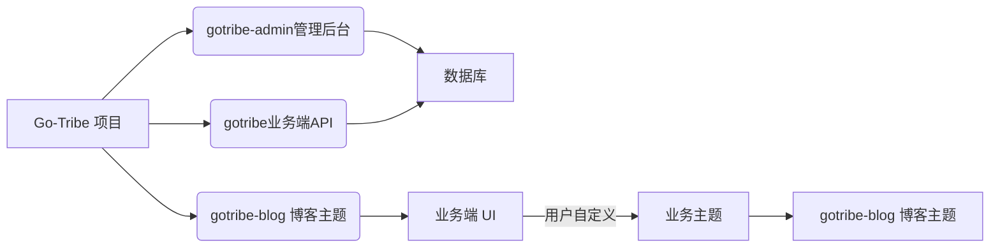

  

一个有趣的组织

## 项目

项目整体采用前后端分离。由管理端 API，业务端 API，管理后台UI 三部分组成，业务端 UI 可自行根据需求开发。也可使用我们的模版。

### 核心
| 项目 | 描述       |地址|
| --- |----------| --- |
| gotribe-admin | 后台管理 api | https://github.com/go-tribe/gotribe-admin.git |
| gotribe | 业务端 api  | https://github.com/go-tribe/gotribe.git |
| gotribe-admin-vue | 管理后台 UI  | https://github.com/go-tribe/gotribe-admin-vue.git |

### 业务主题
| 主题          | 描述        | 地址                                           |
|-------------|-----------|----------------------------------------------| 
| gotribe-blog | 一个简单的博客主题 | https://github.com/go-tribe/gotribe-blog.git  |

### 关系图

上图清晰地描绘了Go-Tribe项目的结构和组件之间的交互：

**Go-Tribe** 是整个系统框架的名称，它包括多个模块，每个模块负责不同的功能。  

**gotribe-admin 管理后台**：这是系统的核心管理模块，用于处理后台管理任务。考虑到安全性，通常部署在内部网络并通过VPN访问。为了简化部署流程，我们将gotribe-admin-vue 管理后台 UI与管理后台 API集成在一起，实现一键部署。  

**gotribe 业务端 API**：此模块负责处理业务逻辑，特别关注搜索引擎优化（SEO）和开发效率。它与业务端 UI 完全解耦，支持 Kubernetes 部署和水平扩展，以适应不同规模的业务需求。  

**gotribe-blog 博客主题**：提供了一个预构建的博客主题，作为业务主题的一个示例，展示如何利用Go-Tribe框架快速搭建特定业务场景。  

**数据库**：作为系统的数据存储中心，负责保存所有必要的数据信息。  

**业务端 UI**：用户可以根据自己的具体需求，利用Go-Tribe提供的模板自行开发定制化的前端界面。  

整个系统采用前后端分离的架构设计，这不仅提高了系统的灵活性，还使得各个组件能够独立开发和维护，从而增强了系统的可扩展性和维护性。  

## 💥 在线应用
[麻凡](https://www.dengmengmian.com)
